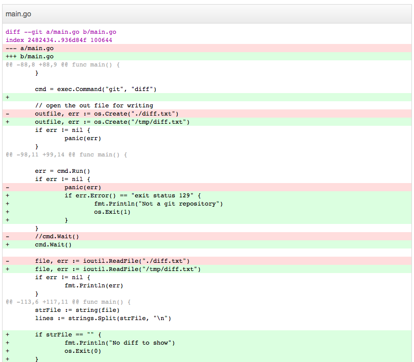

##prettydiff

This app can be used to get pretty `git diff`. Opens an html version in your default browser.

This is a Go port of https://github.com/scottgonzalez/pretty-diff.

##Usage:

$ go get github.com/thewhitetulip/prettydiff

I recommend that you install it in $GOBIN by using the go install, so you can use prettydiff in any git repository.

###Dependencies:

We use http://github.com/skratchdot/open-golang/open to launch the default browser.

License: MIT.

##Screenshot

Made with :heart: in India.